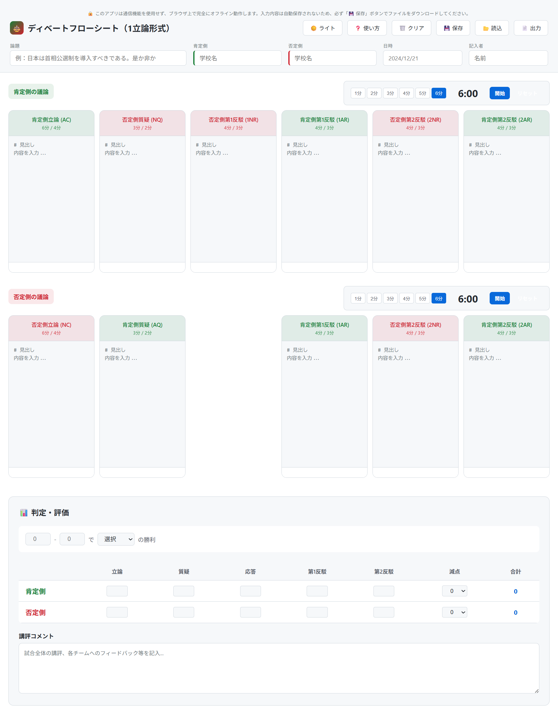
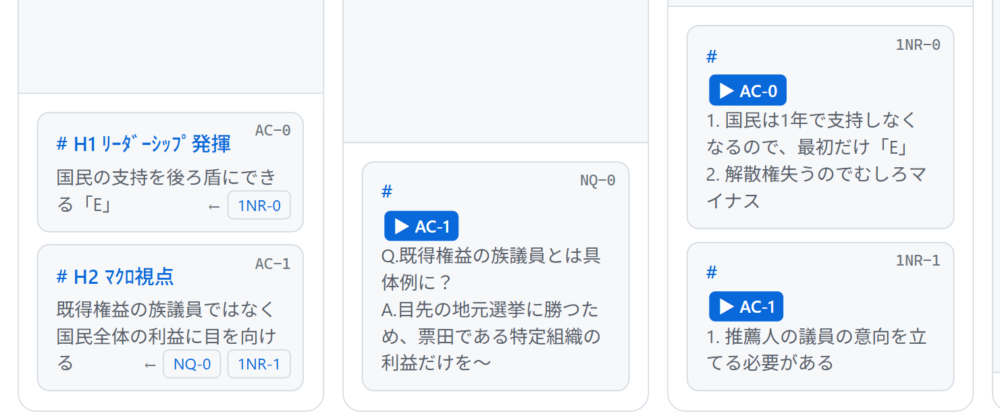

# Debate Flowsheet

完全オフラインで動作するディベートフローシートアプリ（NADE非公式）




## 概要

ディベート試合のフロー記録に特化したWebアプリです。

### ディベートフォーマット

- **1CON形式** - 1立論形式（高校ディベート） ✅ 利用可能
- **2CON形式** - 2立論形式（大学・社会人ディベート） 🚧 準備中

## デモ
以下リンクから利用できます。
🔗 [GitHub Pagesでデモを見る](https://mikisayaka19.github.io/debate-flowsheet/)


## 特徴

- **完全オフライン動作** - 通信機能を使用せず、ディベート大会のルールに完全準拠
- **複数形式対応** - 立論の回数に応じたディレクトリ構成（1con/2con）
- **リアルタイム記録** - 肯定側・否定側の議論を並行して記録
- **ブロック参照システム** - `#` マークダウン記法でブロックを定義し、`>` 記法で参照可能
- **判定・評価機能** - 勝敗判定、コミュニケーション点、講評を記録
- **データ保存/読込** - JSON形式でのエクスポート/インポート
- **Markdown出力** - フローシートをMarkdown形式で出力可能
- **ダークモード対応** - ライト/ダークテーマの切り替え
- **単一HTMLファイル** - 外部依存なし、ブラウザで開くだけで使用可能

## 使い方

### アクセス方法

#### オンライン（GitHub Pages）
1. https://mikisayaka19.github.io/debate-flowsheet/ にアクセス
2. 使用したい形式（1CON/2CON）を選択
3. アプリが起動

#### オフライン（ローカル）
1. このリポジトリをダウンロードまたはクローン
2. zipファイルを展開し、以下のhtmlファイルをダブルクリックする（お使いのブラウザでフローアプリが開きます）:
   - `1con/index.html` - 1立論形式（高校ディベート）
   - `2con/index.html` - 2立論形式（準備中）

### 基本的な使用方法

1. 論題、チーム名、日時、記入者を入力
2. ディベートの進行に合わせて各列に記録
3. 【応用】ブロック記法（`#`）で議論を構造化
4. 【応用】参照記法（`>`）でブロック間の関連を記録
5. 試合終了後、判定・評価を記入
6. 「データを保存」でJSONファイルとしてダウンロード

### 【応用】論点と論点を繋げる際の記法
できる限りシンプルな作りのアプリにするため、フローの矢印機能は実装していません。

ただし、以下のブロック記法で、**論点と論点を繋げる**ことができます。


#### ブロックの定義
```
# 経済成長のメリット
GDP向上により雇用が増加する
```
`#` で始まる行が新しいブロックを作成します。各ブロックには位置ベースのID（AC-0、AC-1...）が自動的に割り当てられます。

#### ブロック参照
```
> AC-0
この反論は肯定側立論の経済成長メリットに対するものです
```
`> AC-0` または、`> ac-0`のように記述すると、該当ブロックへのクリック可能なリンクが生成されます。



## 1CON形式の詳細

### 列の省略記号
- **AC** - 肯定側立論
- **NQ** - 否定側質疑
- **NC** - 否定側立論
- **AQ** - 肯定側質疑
- **1AR** - 肯定側第1反駁
- **1NR** - 否定側第1反駁
- **2AR** - 肯定側第2反駁
- **2NR** - 否定側第2反駁

## リポジトリ構成

```
debate-flowsheet/
├── index.html              # ランディングページ（形式選択）
├── 1con/
│   └── index.html         # 1CON形式アプリ（高校ディベート）
├── 2con/
│   └── index.html         # 2CON形式アプリ（準備中）
├── screenshots/            # スクリーンショット
├── README.md              # このファイル
├── LICENSE                # MIT License
└── .gitignore             # Git除外設定
```

## データの保存と読込

- **保存**: 「データを保存」ボタンをクリックし、JSON形式でダウンロード
- **読込**: 「データを読込」ボタンをクリックし、保存したJSONファイルを選択

ファイル名形式: `debate-flow-YYYYMMDD--<論題>-<肯定側>-<否定側>.json`

## 出力形式

「フローシートを出力」ボタンから以下の形式でエクスポート可能:
- **Markdown** (.md) - 構造化された読みやすい形式
- **テキスト** (.txt) - プレーンテキスト形式

## 技術仕様

- **HTML5** + **CSS3** + **Vanilla JavaScript**
- フレームワーク不使用
- 外部CDN依存なし
- システムフォント使用
- LocalStorage（テーマ設定のみ）


## プライバシー

このアプリケーションは:
- ✅ 完全オフラインで動作
- ✅ データを外部に送信しない
- ✅ トラッキングなし
- ✅ 外部リソース読み込みなし

ディベート大会の通信禁止ルールに完全準拠しています。

## ブラウザ対応

モダンブラウザの最新版を推奨:
- Google Chrome
- Microsoft Edge
- Mozilla Firefox
- Safari

## ライセンス

MIT License - 詳細は [LICENSE](LICENSE) をご覧ください。

## 免責事項

このアプリケーションは無保証で提供されます。以下の点にご注意ください：

- **データ損失のリスク**: ブラウザのクラッシュ、誤操作、端末の不具合等により、記録したフローシートのデータが失われる可能性があります
- **保存の推奨**: 重要な試合の記録は、こまめに「💾 保存」ボタンでJSONファイルとしてダウンロードすることを強く推奨します
- **動作保証なし**: すべてのブラウザ・OS環境での完全な動作を保証するものではありません
- **責任の範囲**: このアプリケーションの使用により生じたいかなる損害（フロー記録の損失、試合結果への影響等）についても、開発者は一切の責任を負いません

**使用前の確認事項:**
- ✅ 試合開始前に動作確認を行ってください
- ✅ 定期的にデータ保存を行ってください
- ✅ 重要な試合では予備の記録手段を用意してください

本アプリケーションは、あくまでディベート活動を支援するための補助ツールです。自己責任のもとでご使用ください。